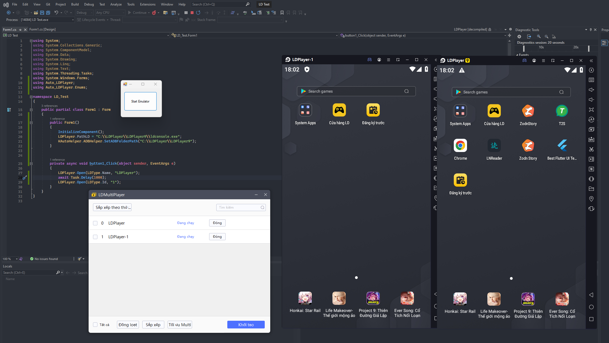

# AutoLDPlayer

Auto ADB LDPlayer
Release Bao Gồm

-   KAutoHelpper
-   Emgu.CV.World.dll
-   Auto_LDPlayer.dll

# Demo



# Nuget

### Nuget: https://www.nuget.org/packages/Auto_LDPlayer

```js
PM> Install-Package Auto_LDPlayer
```

# List Command

```js
Note:
param => name, index. nameOrId => "Name LDPlayer Or Index LDPlayer"
deviceID get form cmd "adb devices" or used void "GetDevices2_Running()" return the variable "adb_id"
```

```
For the new Emgu Nuget package you do need to use PackageReference instead of the traditional package.config.

- Uninstall all NuGet Packages [This removes the package.config file]
- Go to Tools --> Options --> NuGet Package Manager --> General
- Change the default package management format to "PackageReference"
- Check "allow format selection on first package install"
- Click OK
- Install Emgu.CV, Emgu.CV.Bitmap, Emgu.CV.UI and Emgu.CV.runtime.windows
- These Emgu packages should now appear under your references and you should not see a package.config file.
```

1. **Set Path LDPlayer "ldconsole.exe"**

```js
LDPlayer.pathLD = "Your Path ldconsole.exe"; //VD: "C:\LDPlayer\LDPlayer4.0\ldconsole.exe"
//Set ADB Your Path
KAutoHelper.ADBHelper.SetADBFolderPath(@"C:\LDPlayer\LDPlayer4.0");
```

2. **Initialization**

```js
using Auto_LDPlayer;
using Auto_LDPlayer.Enums;
```

3. **Example**

```js
LDPlayer.Open(LDType.Name, "ld0")
LDPlayer.Open(LDType.Id, "0")
```

4. **Manipulation Emulator**

```js
void Open(LDType ldType, string nameOrId)

void OpenApp(LDType ldType, string nameOrId, string packageName) //Mở LD cùng app khi chạy

void Close(LDType ldType, string nameOrId)

void CloseAll()

void ReBoot(LDType ldType, string nameOrId)
```

5. **Custom Emulator**

```js
void Create(string name)

void Copy(string name, string fromNameOrId)

void Delete(LDType ldType, string nameOrId)

void Rename(LDType ldType, string nameOrId, string titleNew)
```

6. **App**

```js
void InstallAppFile(LDType ldType, string nameOrId, string fileName) //fileName trỏ tới file apk

void InstallAppPackage(LDType ldType, string nameOrId, string packageName) //Cài qua LD Store, hơi dỏm, tốt nhất tự cài apk

void UninstallApp(LDType ldType, string nameOrId, string packageName)

void RunApp(LDType ldType, string nameOrId, string packageName)

void KillApp(LDType ldType, string nameOrId, string packageName)
```

7. **Other**

```js
void Locate(LDType ldType, string nameOrId, string Lng, string Lat) //Set Toạ Độ GPS
```

```js
void ChangeProperty(LDType ldType, string nameOrId, string cmd)
    cmd use:
    [--resolution ]
    [--cpu < 1 | 2 | 3 | 4 >]
    [--memory < 512 | 1024 | 2048 | 4096 | 8192 >]
    [--manufacturer asus]
    [--model ASUS_Z00DUO]
    [--pnumber 13812345678]
    [--imei ]
    [--imsi ]
    [--simserial ]
    [--androidid ]
    [--mac ]
    [--autorotate < 1 | 0 >]
    [--lockwindow < 1 | 0 >]

    Exam:   LDPlayer.Change_Property("name", "ld0", " --cpu 1 --memory 1024 --imei 123456789");
```

```js
void SetProp(LDType ldType, string nameOrId, string key, string value)

string GetProp(LDType ldType, string nameOrId, string key)

string ADB(LDType ldType, string nameOrId, string cmd)

void DownCPU(LDType ldType, string nameOrId, string rate)

void Backup(LDType ldType, string nameOrId, string filePath)

void Restore(LDType ldType, string nameOrId, string filePath)

void Action(LDType ldType, string nameOrId, string key, string value)

void Scan(LDType ldType, string nameOrId, string filePath)

void SortWnd() //Sắp Xếp Tab Giả Lập

void zoomIn(LDType ldType, string nameOrId) //Phóng to

void zoomOut(LDType ldType, string nameOrId) //Phóng nhỏ lại

void Pull(LDType ldType, string nameOrId, string remoteFilePath, string localFilePath)

void Push(LDType ldType, string nameOrId, string remoteFilePath, string localFilePath)

void BackupApp(LDType ldType, string nameOrId, string packageName, string filePath)

void RestoreApp(LDType ldType, string nameOrId, string packageName, string filePath)
```

```js
void GlobalConfig(LDType ldType, string nameOrId, string fps, string audio, string fastPlay, string cleanMode)
    [--fps <0~60>] [--audio <1 | 0>] [--fastplay <1 | 0>] [--cleanmode <1 | 0>]
    Exam: LDPlayer.Golabal_Config("name", "ld0", "60", "0", "0", "0");
```

8. **Get List Devices**

```js
List<string> GetDevices()

List<string> GetDevicesRunning()

bool IsDeviceRunning(LDType ldType, string nameOrId)

List<LDevice> GetDevices2()

List<LDevice> GetDevices2Running()
```

9. **Cmd**

```js
void ExecuteLD(string cmd)

string ExecuteLDResult(string cmdCommand)
```

10. **Directional**

```js
void Back(string deviceID)

void Home(string deviceID)

void Menu(string deviceID)
```

11. **Tap with OpenCV**

```js
void TapImg(string deviceID, Bitmap imgFind)
```

12. **Change Proxy**

```js
void ChangeProxy(string deviceID, string ipProxy, string portProxy)

void RemoveProxy(string deviceID)
```
